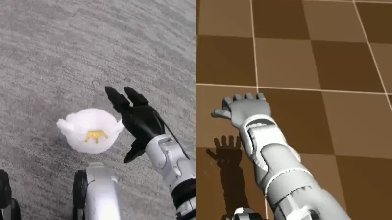

<div align="center">
  <h1 align="center"> OpenWBT </h1>
  <h3 align="center"> 银河通用机器人 · 清华大学 </h3>
  <!-- <p align="center">
    <a href="README.md"> English </a> | <a href="README_zh.md">中文</a>
  </p>     -->

[中文](README_zh.md) |[英文](README.md)

:page_with_curl:[论文](https://www.arxiv.org/pdf/2505.10918) | :house:[主页](https://zzk273.github.io/R2S2/)
</div>


# 介绍
该项目的技术实现主要由[R2S2](https://zzk273.github.io/R2S2/)支持。该仓库实现了使用 Apple Vision Pro 对宇树（Unitree）G1 和 H1 人形机器人 进行**全身**的**遥操作控制**，该系统支持**不仅支持实机也能使用户在仿真中遥操**，基于该系统可以控制机器人像人一样运动、蹲、弯、抓，搬等，大幅度扩展了机器人作业空间以实现更多任务。


## 效果：
<p align="center">

</p>

<!-- <p align="center">
  <table>
    <tr>
      <td align="center" width="50%">
        <a href="https://www.bilibili.com/video/x" target="_blank">
          
        </a>
        <p><b> 实机演示</b></p>
      </td>
      <td align="center" width="50%">
        <a href="https://www.bilibili.com/video/x" target="_blank">
          
        </a>
        <p><b> 仿真演示 </b></p>
      </td>
    </tr>
  </table>
</p> -->


# 硬件清单与环境配置
请看 [配置教程](installation_zh.md) 

# 运行
## 启动机器人
   
先启动机器人：
- 短按+长按机器人开机键，等待头部蓝光亮起并停止闪烁 

使用宇树遥控器进入阻尼模式（也可以参考[宇树官方文档](https://support.unitree.com/home/zh/G1_developer/remote_control)）：
-  短按+长按遥控器开机键
-  L2+R2 进入调试模式
-  L2+A 进入诊断模式（此时机器人会做出预备姿势）
-  L2+B 进入阻尼模式

## 网线连接机器人并启动端侧图像服务

第一次连接机器人需要为其配置连接`wifi`以安装一些依赖。wifi的配置请参考[FAQ from unitree](https://support.unitree.com/home/zh/G1_developer/FAQ)。以下是一种方式：

修改 01-netcfg.yaml 文件中 `wifi` 名称以及对应密码,并将
`01-netcfg.yaml`放到端侧`/etc/netplan/`：


``` bash
scp ./01-netcfg.yaml unitree@192.168.123.164:~/ # 传到机器人根目录

# 进入远程桌面
ssh unitree@192.168.123.164
123 # 密码
1 # 选择 ros2 foxy（1）版本
sudo cp 01-netcfg.yaml /etc/netplan/
netplan apply # *中间可能会提示重启网络服务，多试几次即可*

#安装依赖
pip install pyzmq
pip install pyrealsense2
```

启动图像服务的python文件传到机器人端运行
``` bash
scp ./deploy/teleop/image_server/image_server.py unitree@192.168.123.164:~/image_server/
scp unitree@192.168.123.164:~/image_server/image_server.py  ./deploy/teleop/

ssh unitree@192.168.123.164
123 # 密码
1 # 选择 ros2 foxy（1）版本
cd image_server
python image_server.py
```

## 执行遥操作程序
电脑连接手柄并给予两手柄权限（默认手柄接口为左手/dev/ttyACM0和右手/dev/ttyACM1）

```bash
sudo chmod -R 777 /dev/ttyACM0; sudo chmod -R 777 /dev/ttyACM1
```
真机运行：
``` bash
source /opt/ros/foxy/setup.sh; source ~/unitree_ros2/setup.sh
python -m deploy.run_teleoperation_real --config run_teleoperation.yaml --net eno1
```
仿真器中运行：
```bash
source /opt/ros/foxy/setup.sh; source ~/unitree_ros2/setup.sh
python -m deploy.run_teleoperation_mujoco --config run_teleoperation.yaml
```
注：
- eno1 需要换成正确的网口名称
- 可进入调试模式，此时policy的action不会被执行
```bash
source /opt/ros/foxy/setup.sh; source ~/unitree_ros2/setup.sh
python -m deploy.run_teleoperation_real --config run_teleoperation.yaml --net eno1 --debug
```


## 进入 VR

**前提条件：用户电脑端已经执行遥操作程序并且机器人已开启图像服务**
在此项目中第一次连接使用时请参考`installation.md`对应章节。

打开Apple Vision Pro 的浏览器输入 `https://192.168.123.2:8012?ws=wss://192.168.123.2:8012` 点击 "Enter VR" 并且允许跟踪，就可以看到第一人称画面 ,此时即可使用 Vision Pro  和手柄控制实际机器人。

注： 
- 替换 192.168.123.2 成自己的wifi IP地址。

如无法在VR中显示图片，请再三确认：
- 是否按照`installation.md`投送、安装并信任了证书
- 上述网址是否一字不差

## 使用手柄控制robot

1. 短按右手手柄开机键使机器人进入预备姿态
2. 长按右手手柄开机键机器人进入启动状态（此时为原地遥操作模式）
3. 短按左手手柄`A`键机器人进入下肢运动遥操作控制--左右手手柄摇杆控制行走与转身
4. 下肢运动遥操作模式下，短按左手手柄`D`键机器人停止踏步
5. 短按右手手柄`A`键机器人进入原地遥操作控制--左右手手柄摇杆控制蹲起和上身俯仰角
- *短按右手手柄`D`键机器人进入安全阻尼状态*

# TODO 列表

- \[x\] 发布R2S2论文和演示视频  
- \[x\] 发布 Unitree G1 的真实世界全身遥操作功能  
- \[x\] 发布 Unitree G1 的 Mujoco 仿真全身遥操作功能  
- \[ \] 发布 Unitree H1 的全身遥操作功能  
- \[ \] 发布 Latent Skill Space  

# 引用

如果觉得我们的工作能帮到您，请引用:

```bibtex
@article{zhang2025unleashing,
  title={Unleashing Humanoid Reaching Potential via Real-world-Ready Skill Space},
  author={Zhang, Zhikai and Chen, Chao and Xue, Han and Wang, Jilong and Liang, Sikai and Liu, Yun and Zhang, Zongzhang and Wang, He and Yi, Li},
  journal={arXiv preprint arXiv:2505.10918},
  year={2025}
}
```
# 许可证

OpenWBT 的所有代码均遵循[Apache License 2.0](https://www.apache.org/licenses/LICENSE-2.0).

[](https://opensource.org/licenses/Apache-2.0)

# 鸣谢

该代码基于以下开源代码库构建。请访问以下链接查看各自的许可证：

1. https://github.com/OpenTeleVision/TeleVision
2. https://github.com/unitreerobotics/avp_teleoperate

# 联系我们

如果你有想讨论的内容，欢迎发送邮件至 zhikaizhang273@gmail.com，或添加微信号：zzk273939。
